# System Design: Solana Chain Port

## Architecture Overview

```mermaid
graph TD
    subgraph "Frontend (Next.js)"
        UI["pages/index.tsx\nMarket Dashboard"]
        Agents["pages/agents.tsx\nAgent Registry"]
        Resolve["pages/resolve.tsx\nOutcome Resolution"]
        Wallet["@solana/wallet-adapter\nSolana wallets"]
    end

    subgraph "API Routes (Next.js API Routes)"
        Prepare["POST /api/solana/prepare-agent"]
        Register["POST /api/solana/register-agent"]
        CreateMarket["POST /api/solana/market/create"]
        MintShares["POST /api/solana/market/mint-shares"]
        ResolveOutcome["POST /api/solana/market/resolve"]
        Vote["POST /api/solana/vote"]
        Pay["POST /api/solana/payout"]
    end

    subgraph "Solana Programs (Anchor/Pinocchio)"
        Registry["DIVE Registry Program"]
        Market["DIVE Market Program"]
        Identity["SAID Identity Program"]
        Payment["Payment Program"]
        Oracle["Oracle Resolution Program"]
    end

    subgraph "Solana On-Chain State (PDAs)"
        AgentPDA["Agent PDA\n(wallet → agent config)"]
        MarketPDA["Market PDA\n(marketId → market state)"]
        SharesPDA["Shares PDA\n(user + market → position)"]
        VotePDA["Vote PDA\n(market + agent → vote)"]
        ReputationPDA["Reputation PDA\n(wallet → HCS-20 equivalent score)"]
    end

    subgraph "Solana Infrastructure"
        Helius["Helius RPC\n(DAS API, webhooks)"]
        HeliusWS["Helius WebSocket\n(real-time events)"]
        Jupiter["Jupiter API\n(USDC swap & settlement)"]
        Switchboard["Switchboard\n(VRF for dispute resolution)"]
        Metaplex["Metaplex Core NFT\n(Agent Identity NFT)"]
        SAID["SAID Protocol\n(Human verification)"]
        Pyth["Pyth\n(Price feeds for markets)"]
    end

    subgraph "Inference Layer"
        OGCompute["0G Compute\n(LLM inference — unchanged)"]
        InferenceAPI["POST /api/infer\nSolana-gated inference"]
    end

    Wallet --> Prepare
    Wallet --> Register
    UI --> CreateMarket
    UI --> MintShares

    Prepare --> Registry
    Register --> Registry
    Register --> Metaplex
    Register --> SAID

    CreateMarket --> Market
    MintShares --> Market
    ResolveOutcome --> Oracle
    Oracle --> Market
    Vote --> Oracle

    Registry --> AgentPDA
    Market --> MarketPDA
    Market --> SharesPDA
    Oracle --> VotePDA

    MarketPDA --> Helius
    AgentPDA --> Helius

    Market --> Payment
    Payment --> Jupiter

    Oracle --> Switchboard
    Market --> Pyth

    InferCall["Agent inference call"] --> OGCompute
    InferenceAPI --> OGCompute
```



### Key Architectural Changes from Hedera Stack

| Hedera/0G Concept | Solana Replacement | Implementation |
|---|---|---|
| HCS Topic (voting/registry/reputation) | PDA accounts in Anchor program | `dive_registry`, `dive_market`, `dive_reputation` programs |
| ERC-7857 iNFT on 0G | Metaplex Core NFT | `metaplex-skill` + `dive_agent_nft` collection |
| World ID / AgentBook lookupHuman | SAID Protocol or signature verification | `said-protocol-skill` or `sign-verification` |
| HCS-20 message replay | On-chain account state (no replay needed) | PDA `reputation` account accumulates |
| HTS token shares | SPL tokens (Token-2022) | Token mint + transfer via `@solana/spl-token` |
| x402/Base USDC payments | Jupiter USDC settlement + x402 on Solana | `jupiter-skill` + `x402-proxy` |
| Hedera account ID (0.0.xxxxx) | Solana pubkey (base58) | `@solana/wallet-adapter` |
| HCS-20 balances (replay) | `reputation` PDA (real-time) | Direct `getAccountInfo` |
| HCS-2 registry state (replay) | `agent` PDA (no replay) | Direct read |
| HCS-11/2/20 topic logs | Program instruction logs + account changes | Helius DAS / WebSocket |

## Data Models

### Program-Derived Addresses (PDAs)

All DIVE PDAs follow the pattern: `Program ID + [discriminator bytes] + seed(s)`

```typescript
// Anchor IDL types — replaces hedera-state.json

#[derive(Accounts)]
pub struct AgentAccount<'info> {
    #[account(
        seeds = [b"agent".as_ref(), agent_pubkey.as_ref()],
        bump
    )]
    pub agent: Account<'info, Agent>,
    pub payer: Signer<'info>,
    pub system_program: Program<'info, System>,
}

#[derive(Accounts)]
pub struct MarketAccount<'info> {
    #[account(
        seeds = [b"market".as_ref(), market_id.as_ref()],
        bump
    )]
    pub market: Account<'info, Market>,
    pub payer: Signer<'info>,
    pub system_program: Program<'info, System>,
}

#[derive(Accounts)]
pub struct SharesAccount<'info> {
    #[account(
        seeds = [b"shares".as_ref(), market_id.as_ref(), owner.as_ref()],
        bump
    )]
    pub shares: Account<'info, Shares>,
}

// Discriminator-based account types (Anchor)

// Agent — replaces HCS-2 registry entry
#[account]
pub struct Agent {
    pub authority: Pubkey,           // wallet that controls this agent
    pub said_id: Option<Pubkey>,      // SAID Protocol identity (if used)
    pub name: String,                // agent display name
    pub config_uri: String,          // IPFS/Arweave URI for agent config
    pub nft_mint: Pubkey,            // Metaplex Core NFT mint (agent identity)
    pub reputation: u64,             // computed from vote history (HCS-20 equivalent)
    pub total_predictions: u64,
    pub correct_predictions: u64,
    pub registered_at: i64,
    pub bump: u8,
}

// Market — replaces HTS token + HCS topic state
#[account]
pub struct Market {
    pub creator: Pubkey,
    pub question: String,
    pub description: String,
    pub outcomes: Vec<String>,       // e.g., ["Yes", "No"] or multiple options
    pub market_token: Pubkey,        // SPL token mint for market shares
    pub resolution_authority: Pubkey, // agent pubkey that can submit resolution
    pub status: MarketStatus,       // Open | Resolved | Dispute | Cancelled
    pub resolved_outcome: Option<u8>,
    pub created_at: i64,
    pub end_time: i64,
    pub bump: u8,
}

#[derive(AnchorSerialize, AnchorDeserialize, Clone, PartialEq, Eq)]
pub enum MarketStatus {
    Open,
    Dispute,
    Resolved,
    Cancelled,
}

// Shares — replaces HTS share positions (no replay needed)
#[account]
pub struct Shares {
    pub owner: Pubkey,
    pub market: Pubkey,
    pub outcome_balances: Vec<u64>, // balance per outcome index
    pub bump: u8,
}

// Vote — replaces HCS-20 vote messages
#[account]
pub struct Vote {
    pub voter: Pubkey,
    pub market: Pubkey,
    pub voted_outcome: u8,
    pub stake: u64,                  // SPL tokens staked on vote
    pub timestamp: i64,
    pub bump: u8,
}

// Reputation — replaces HCS-20 balance computation
#[account]
pub struct Reputation {
    pub authority: Pubkey,
    pub score: u64,                  // HCS-20 "balance" equivalent
    pub total_votes: u64,
    pub correct_votes: u64,
    pub last_updated: i64,
    pub bump: u8,
}
```

### SPL Token (Market Shares)

Each market creates its own SPL token mint. Share minting:

```typescript
// Replaces: hedera/hcs-standards.ts — HTS share minting
import { createMint, mintTo, transfer } from "@solana/spl-token";
import { getOrCreateAssociatedTokenAccount } from "@solana/spl-token";

async function createMarketToken(connection: Connection, payer: Keypair, market: PublicKey) {
    const mint = await createMint(connection, payer, payer.publicKey, null, 6);
    // 6 decimals matches USDC precision for easy settlement
    return mint;
}

async function mintShares(
    connection: Connection,
    payer: Keypair,
    mint: PublicKey,
    buyer: PublicKey,
    amount: number
) {
    const buyerTokenAccount = await getOrCreateAssociatedTokenAccount(
        connection, payer, mint, buyer
    );
    await mintTo(connection, payer, mint, buyerTokenAccount.address, amount);
}
```

## API Design

### API Route Changes (pages/api/ → pages/api/solana/)

| Old Endpoint | New Endpoint | Notes |
|---|---|---|
| `POST /api/inft/prepare-agent` | `POST /api/solana/prepare-agent` | Creates Solana keypair, no Hedera account needed |
| `POST /api/inft/register-agent` | `POST /api/solana/register-agent` | Mints Metaplex Core NFT + initializes Agent PDA + SAID verification |
| `POST /api/inft/infer` | `POST /api/solana/infer` | Unchanged inference; Solana wallet gate |
| `POST /api/market/create` | `POST /api/solana/market/create` | Creates Market PDA + SPL token mint |
| `POST /api/market/mint-shares` | `POST /api/solana/market/mint-shares` | Mint SPL shares to buyer |
| `POST /api/market/resolve` | `POST /api/solana/market/resolve` | Oracle resolution via program instruction |
| `POST /api/vote` | `POST /api/solana/vote` | Vote with stake via Vote PDA |
| `POST /api/payout` | `POST /api/solana/payout` | Jupiter USDC settlement via CPI |
| `GET /api/state` | `GET /api/solana/state` | Reads PDAs via Helius RPC (no message replay) |

### New API Endpoints

```
POST /api/solana/agent/verify-said     — Verify SAID identity via SAID Protocol
POST /api/solana/agent/mint-nft        — Mint Metaplex Core NFT for agent identity
POST /api/solana/agent/update-config    — Update agent config URI on-chain
POST /api/solana/market/create         — Initialize market with SPL token
POST /api/solana/market/buy-shares     — Buy shares via Jupiter quote (wraps SPL mint)
POST /api/solana/market/dispute         — Open dispute with Switchboard VRF
POST /api/solana/market/settle         — Run settlement after resolution
POST /api/solana/vote/delegate         — Delegate voting rights to another agent
POST /api/solana/reputation/sync       — Sync reputation from Vote PDA history
GET  /api/solana/agent/:pubkey          — Fetch agent PDA state
GET  /api/solana/market/:marketId      — Fetch market PDA state
GET  /api/solana/shares/:market/:owner  — Fetch shares position
```

### API Authentication

- **Wallet signatures** replace Hedera operator key auth
- All write operations signed by the wallet via `@solana/wallet-adapter`
- Read operations use Helius RPC (no auth needed)
- SAID Protocol verification calls external API (stateless)

### Request/Response Formats

```typescript
// POST /api/solana/register-agent
interface RegisterAgentRequest {
    authority: string;        // base58 Solana pubkey
    name: string;             // "Oracle Agent Alpha"
    configUri: string;        // "ipfs://Qm.../config.json"
    saidId?: string;         // SAID Protocol identity (optional)
    nftMetadataUri: string;  // "arweave://.../metadata.json"
}

interface RegisterAgentResponse {
    agentPubkey: string;     // Agent PDA address
    nftMint: string;         // Metaplex Core NFT mint
    signature: string;        // tx signature
    blockhash: string;
}

// POST /api/solana/market/create
interface CreateMarketRequest {
    creator: string;         // Solana pubkey
    question: string;        // "Will BTC exceed $100k by Jan 2025?"
    outcomes: string[];      // ["Yes", "No"]
    endTime: number;         // Unix timestamp
    resolutionAuthority: string; // agent pubkey
    initialLiquidity?: number; // USDC amount for initial market liquidity
}

// POST /api/solana/market/resolve
interface ResolveMarketRequest {
    marketId: string;
    resolution: number;      // outcome index (0 = Yes, 1 = No)
    oracle: string;         // oracle agent pubkey
    evidence?: string;      // URI with resolution evidence
}
```

## Component Breakdown

### Frontend Changes

| Old Component | New Implementation | Skills Reference |
|---|---|---|
| `components/Providers.tsx` (RainbowKit/Wagmi) | `@solana/wallet-adapter` + `@solana/web3.js` | `helius-phantom-skill`, `phantom-connect` |
| `lib/hcs-standards.ts` | New `lib/solana-programs.ts` — Anchor IDL client | `solana-anchor-claude-skill` |
| `lib/wagmi.ts` | `lib/solana-wagmi.ts` (removed — Solana doesn't need Wagmi) | `solana-dev-skill` |
| `lib/prediction-market.ts` | `lib/dive-market.ts` — Solana program CPI calls | `jupiter-skill` |
| State file `hedera-state.json` | Replaced by on-chain PDAs (no local state file) | Helius DAS API |
| World ID button | SAID Protocol verify button | `said-protocol` |
| x402 payment UI | Jupiter USDC payment UI | `jupiter-skill` + `agentic-gateway` |

### Backend Changes

| Old Library | New Library | Skills Reference |
|---|---|---|
| `lib/hcs-standards.ts` | `lib/solana/registry.ts` | `solana-anchor-claude-skill` |
| `lib/world-agentkit.ts` | `lib/solana/said-verifier.ts` | `said-protocol` |
| `lib/0g-compute.ts` | `lib/0g-compute.ts` (unchanged) | — |
| `lib/encrypt.ts` | `lib/solana/encrypt.ts` (unchanged logic, Solana key derivation) | — |
| `lib/sparkinft-abi.ts` | `lib/solana/metaplex-nft.ts` | `metaplex-skill` |
| `lib/prediction-market.ts` | `lib/solana/dive-market.ts` | `jupiter-skill`, `solana-dev-skill` |
| `lib/wagmi.ts` | Removed (replaced by `@solana/wallet-adapter`) | `solana-dev-skill` |

### New Solana-Specific Components

| New File | Purpose | Skills Reference |
|---|---|---|
| `programs/dive-protocol/` | Anchor program source (registry + market + oracle) | `solana-anchor-claude-skill`, `pinocchio-skill` |
| `lib/solana/anchor-client.ts` | Anchor IDL generated client wrapper | `solana-anchor-claude-skill` |
| `lib/solana/helius-rpc.ts` | Helius RPC helper (DAS, tx sending) | `helius-skill` |
| `lib/solana/metaplex-nft.ts` | Metaplex Core NFT minting for agents | `metaplex-skill` |
| `lib/solana/said-verifier.ts` | SAID Protocol identity verification | — |
| `lib/solana/jupiter-settlement.ts` | Jupiter USDC payout settlement | `jupiter-skill` |
| `lib/solana/switchboard-vrf.ts` | Switchboard VRF for dispute resolution | `switchboard-skill` |
| `lib/solana/reputation.ts` | Reputation score computation from Vote PDAs | — |
| `pages/api/solana/agent/*.ts` | Agent registration API routes | `solana-dev-skill` |
| `pages/api/solana/market/*.ts` | Market management API routes | `solana-dev-skill` |
| `pages/api/solana/infer.ts` | Inference gate with Solana wallet auth | `solana-anchor-claude-skill` |

## Design Decisions

### 1. Anchor vs Pinocchio for Programs

**Decision: Anchor (default), Pinocchio for compute-heavy paths)**

Rationale: Anchor has the broadest ecosystem support and tooling (IDL generation, Anchor.toml, Anchor test framework). Pinocchio's 88-95% CU reduction is valuable for the `resolve` instruction (which does vote tallying + payout calculation), but Anchor should be the primary framework for maintainability. Per `solana-anchor-claude-skill`, testing uses LiteSVM or native test runners.

Trade-off: Pinocchio adds complexity; use it only for the market resolution program where CU optimization matters.

### 2. SAID Protocol vs Solana Signature Verification for Identity

**Decision: SAID Protocol (primary), Solana signature verification (fallback)**

Rationale: SAID Protocol is the Solana-native equivalent to World ID — agents register a cryptographic identity with on-chain reputation. The `said-protocol` ecosystem provides agent discovery, which aligns with DIVE's oracle agent model. Solana signature verification can serve as a fallback if SAID Protocol has issues.

Source: `awesome-solana-ai` → SAID Protocol entry: "Agents register a cryptographically verifiable identity, build reputation scores, and get discovered in the public agent directory."

### 3. Metaplex Core NFT vs Token-2022 for Agent Identity

**Decision: Metaplex Core NFT**

Rationale: Agent identity as an NFT (not a fungible token) matches the ERC-7857 iNFT mental model more closely. Each agent = 1 unique NFT. Metaplex Core has broad tooling support via `metaplex-skill`. Token-2022 extensions (transfer hooks, metadata) could also work but add complexity.

Trade-off: NFT metadata is richer but slightly more expensive to update vs. Token-2022.

### 4. HCS Message Replay → PDA State

**Decision: Replace all HCS message replay with direct on-chain account reads**

Rationale: The core advantage of Solana over Hedera for DIVE is that account state is always current — no need to replay topic messages. Every operation (vote, registry, reputation) writes directly to a PDA account. The trade-off is that Solana account rent must be budgeted.

Migration: The `hedera-state.json` file is replaced by on-chain PDAs. A migration script will initialize all existing agents' state on Solana PDAs.

### 5. Inference Layer (0G Compute)

**Decision: Keep 0G Compute unchanged**

Rationale: Solana has no native LLM inference. 0G Compute is blockchain-agnostic and already works. The API route `/api/solana/infer` will gate access using Solana wallet signature verification instead of World ID proof. No changes needed to the inference provider itself.

### 6. Payment Settlement: Jupiter USDC

**Decision: Use Jupiter API for USDC settlement**

Rationale: `jupiter-skill` provides Ultra swaps, DCA, and limit orders. For market payout settlement, Jupiter's USDC liquidity is deep enough. The `x402-proxy` skill can handle agent-to-agent micropayments on Solana natively.

### 7. Frontend Wallet Library

**Decision: Replace RainbowKit/Wagmi with `@solana/wallet-adapter`**

Rationale: RainbowKit is EVM-specific. `helius-phantom-skill` and `phantom-connect` provide the canonical Solana wallet connection pattern. The `pages/_app.tsx` dynamic import pattern can remain (Solana wallet adapters work the same way).

### 8. x402 on Solana

**Decision: Implement x402 on Solana via `x402-proxy` or Quicknode RPC**

Rationale: `x402-proxy` has native Solana support. AI agent micropayments should flow through x402 on Solana, replacing the Base Sepolia x402 middleware. `agentic-gateway` skill covers this.

## Non-Functional Requirements

### Performance

- Market resolution must complete within 1 Solana slot (~400ms)
- Vote tallying via Vote PDA iteration: < 2s for markets with up to 100 agents
- Agent registration: single transaction, < 1s finality
- Helius RPC: DAS API for batch account reads (replaces mirror node queries)

### Scalability

- Up to 10,000 agents registered on the DIVE Registry program
- Up to 1,000 simultaneous active markets
- Vote PDA iteration must handle markets with up to 500 voting agents
- Reputation computation: O(1) read from `Reputation` PDA (no replay)

### Security

- All program instructions require wallet signature (no permissionless state writes)
- SAID Protocol verification must succeed before agent registration completes
- Oracle resolution authority checked at program level (only designated agent can resolve)
- CPI calls to SPL token program use strict account validation
- x402 payments use USDC mint validation (no wrapping/bridging)

### Reliability

- Helius webhooks for real-time market/Vote PDA updates (replaces HCS listener)
- Switchboard VRF for dispute resolution (random, verifiable)
- Helius priority fee API for busy network periods
- On-chain state is always consistent (no replay divergence risk)

### Migration

- All existing `hedera-state.json` agents must migrate to Solana PDAs
- Market positions (share balances) must migrate as SPL token holdings
- Reputation scores must migrate to `Reputation` PDAs
- Hedera topic messages are archived (read-only) post-migration